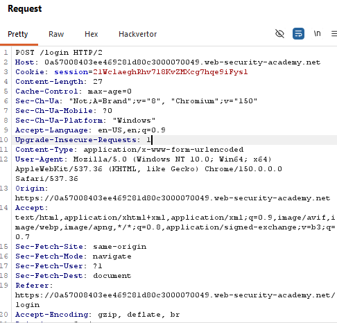
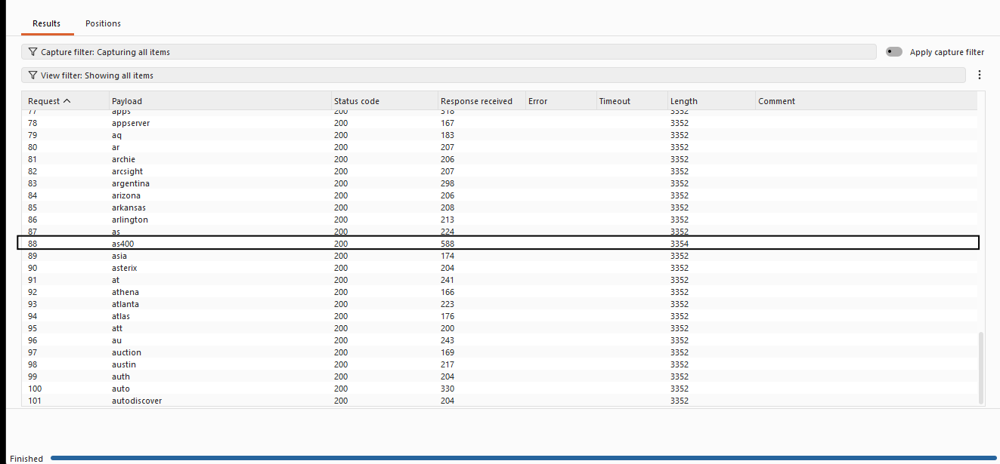
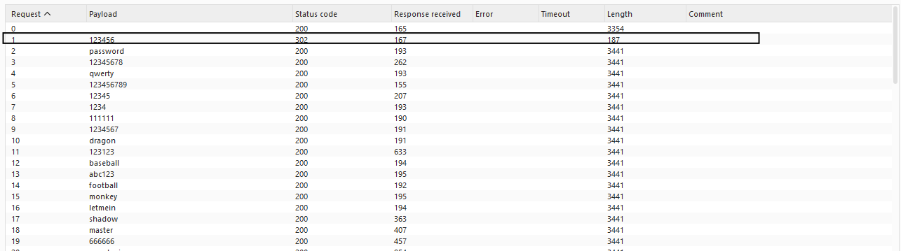
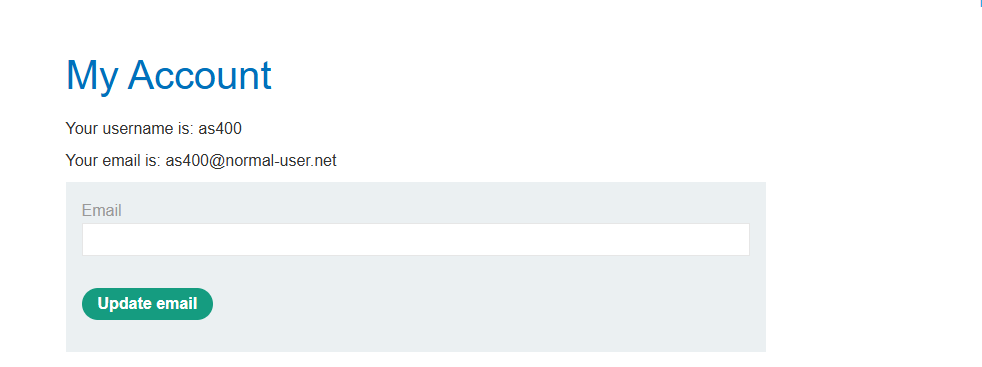

# Lab: Username Enumeration via Different Responses

**Platform:** PortSwigger Web Security Academy  
**Difficulty:** Apprentice  
**Category:** Authentication  
**Tool:** Burp Suite Community Edition

---

## Objective

The objective of this lab was to identify a valid username by analyzing differences in server responses to login attempts. After identifying the valid username, I tested candidate passwords and successfully authenticated to the application.

---

## 1. Initial Login

I first submitted an intentionally invalid username and password (`test` / `test`) to observe how the application responds to invalid credentials.

### Observation

The application returned an **"Invalid username"** response.

### Screenshot


---

## 2. Capturing the Login Request

I used **Burp Suite → Proxy → HTTP history** to capture the login request generated by the application.

The captured request contained the username and password parameters:

```http
POST /login

username=test&password=test
```

I then sent the request to **Burp Intruder** so that I could test multiple candidate usernames while keeping the password fixed.

### Screenshot



---

## 3. Username Enumeration

I configured a **Sniper attack** in Burp Intruder and supplied a list of candidate usernames while keeping the password fixed.

I compared the responses returned for each username to identify differences in the application's behavior.

### Observation

Most usernames produced the same response. However, **`user88`** produced a different response from the other usernames.

This difference indicated that `user88` was a valid username.

### Screenshot



---

## 4. Password Brute Force

After identifying the valid username, I changed the payload position to the password field and used **`user88`** as the fixed username.

I then tested the candidate password list using another **Sniper attack** in Burp Intruder.

### Observation

One request returned an **HTTP 302 redirect**, unlike the other password attempts.

This indicated that the login attempt was successful and that the application was redirecting the authenticated user.

### Screenshot



---

## 5. Successful Login

I used the identified username and password to log into the account.

The application successfully authenticated me and provided access to the account.

### Result

**Lab solved successfully.** ✅

### Screenshot


