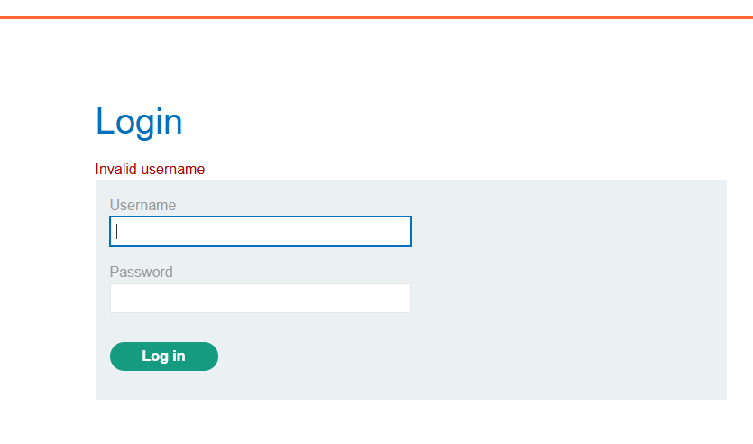

# Lab: Username Enumeration via Different Responses

**Platform:** PortSwigger Web Security Academy  
**Difficulty:** Apprentice  
**Category:** Authentication  
**Tool:** Burp Suite Community Edition

## Objective

The objective of this lab was to identify a valid username by analyzing differences in server responses to login attempts. After identifying the valid username, I tested candidate passwords and successfully authenticated to the application.

---

## 1. Initial Login

I first submitted an intentionally invalid username and password (`test` / `test`) to observe how the application responds to invalid credentials.

**Observation:**  
The application returned an **"Invalid username"** response.

### Screenshot

