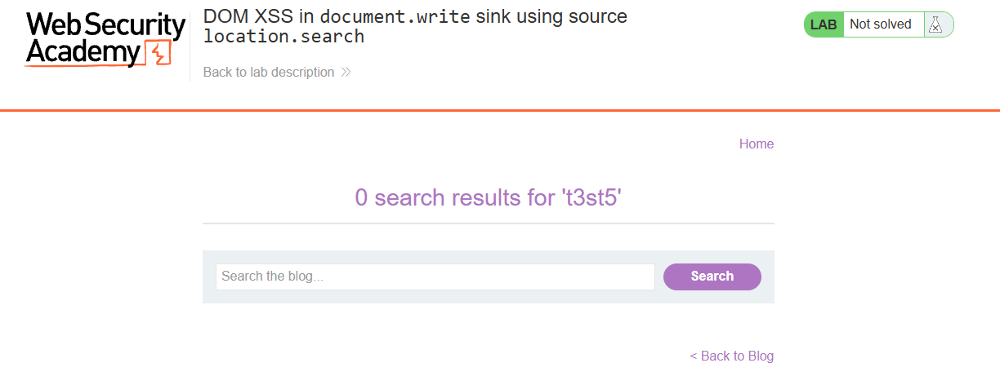
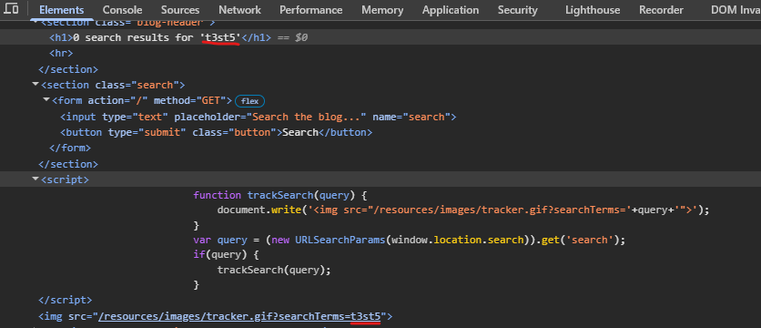
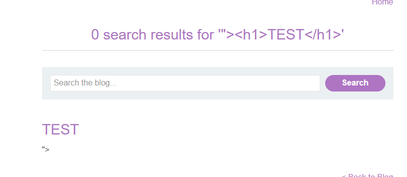
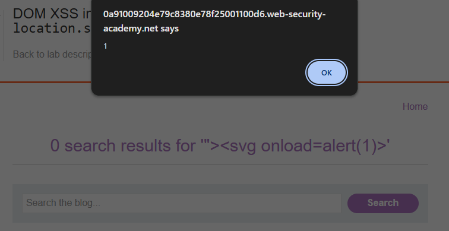

# DOM XSS in `document.write` Sink Using Source `location.search`

**Difficulty:** Apprentice
**Vulnerability:** DOM-based Cross-Site Scripting (XSS)
**Source:** `location.search`
**Sink:** `document.write()`

---

## Vulnerability

The application takes the `search` parameter from the URL and passes it directly to `document.write()` without encoding:

```javascript
var query = (new URLSearchParams(window.location.search)).get('search');
function trackSearch(query) {
    document.write('');
}
```

This allows an attacker to break out of the `img` attribute and inject HTML/JavaScript.

---

## Payload

HTML injection test:

```
"><h1>TEST</h1>
```

Final XSS payload:

```
"><svg onload=alert(1)>
```

The payload successfully triggered `alert(1)`, confirming DOM XSS.

---

## Impact

An attacker could execute arbitrary JavaScript in a victim's browser, potentially modifying page content, performing actions as the victim, or accessing client-side information.

---

## Mitigation

- Avoid using `document.write()` with untrusted input.
- Properly encode user-controlled data before inserting it into HTML.
- Treat URL parameters such as `location.search` as untrusted.
- Use safe DOM APIs such as `textContent` where appropriate.

---

## Evidence

### Initial search


### Vulnerable JavaScript identified in DevTools


### HTML injection confirmed


### `alert(1)` executed


### Lab successfully solved


---

## Key Takeaway

> Always trace **source → sink** when testing for DOM XSS. Here, attacker-controlled data flowed from `location.search` into the dangerous `document.write()` sink.
