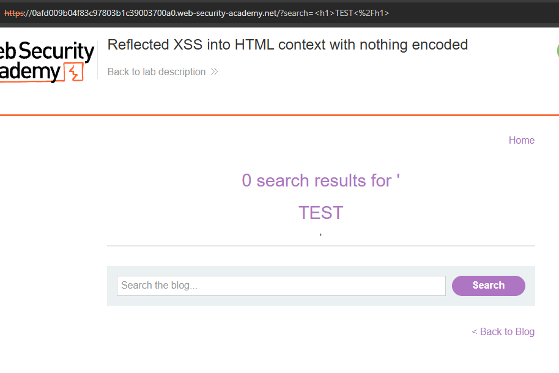
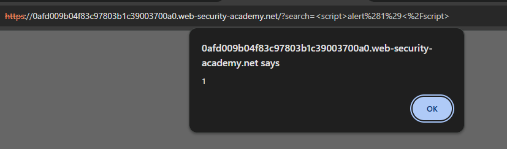
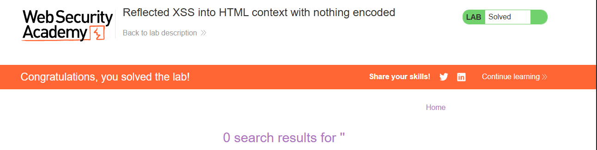

# Reflected XSS into HTML Context with Nothing Encoded

**Difficulty:** Apprentice
**Vulnerability:** Reflected Cross-Site Scripting (XSS)
**Location:** Search functionality

---

## Vulnerability

The application's search functionality reflects user-controlled input directly into the HTML response without proper output encoding.

Because the input is inserted into an HTML context without being safely encoded, an attacker can inject HTML and JavaScript that the browser interprets and executes.

---

## Payload

First, I tested whether HTML was being interpreted:

```html
<h1>TEST</h1>
```

The input was rendered as an HTML heading, confirming that HTML injection was possible.

I then used the XSS payload:

```html
<script>alert(1)</script>
```

The browser executed the JavaScript and displayed an alert, confirming the reflected XSS vulnerability.

---

## Impact

An attacker could potentially execute arbitrary JavaScript in a victim's browser under the context of the vulnerable website.

Depending on the application's functionality and security controls, XSS could potentially be used to:

- Perform actions on behalf of a victim
- Access sensitive information available to JavaScript
- Modify page content
- Conduct phishing attacks within the trusted website's context

---

## Mitigation

- Encode user-controlled data on output according to the context in which it is inserted.
- Validate/filter input where appropriate, using an allowlist of expected input.
- Use a properly configured Content Security Policy (CSP) as an additional defense-in-depth measure.
- Avoid inserting untrusted data directly into HTML.

---

## Evidence

### HTML input rendered by the application


### JavaScript `alert(1)` successfully executed


### PortSwigger confirms the lab was solved


---

## Key Takeaway

> Reflected XSS occurs when user-controlled input is returned in an HTTP response and interpreted as active content by the browser. Output encoding in the correct context is the primary defense.
