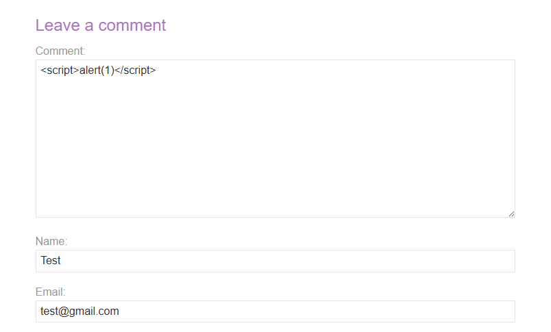

# Stored XSS into HTML Context with Nothing Encoded

**Difficulty:** Apprentice
**Vulnerability:** Stored Cross-Site Scripting (XSS)
**Location:** Comment functionality

---

## Vulnerability

The application's comment functionality stores user-controlled input and later displays it on the webpage without proper output encoding.

Because the input is stored and rendered as HTML, an attacker can inject JavaScript that executes whenever a user views the affected page.

---

## Payload

I submitted the following XSS payload through the comment form:

```html
<script>alert(1)</script>
```

The application stored the payload and executed the JavaScript when the comment was displayed, resulting in an `alert(1)` popup.

This confirmed that the application was vulnerable to Stored XSS.

---

## Impact

Stored XSS is particularly dangerous because the malicious payload is persisted by the application and can execute for other users who view the affected content.

Potential impact includes:

- Execute arbitrary JavaScript in a victim's browser
- Perform actions on behalf of a victim
- Modify webpage content
- Access information available to client-side JavaScript
- Conduct phishing or social engineering attacks within the trusted website's context

---

## Mitigation

- Encode user-controlled data on output according to the context in which it is rendered.
- Validate and sanitize user input where appropriate.
- Avoid inserting untrusted data directly into HTML.
- Use a properly configured Content Security Policy (CSP) as an additional defense-in-depth measure.
- Use safe DOM APIs and frameworks that automatically escape untrusted content where possible.

---

## Evidence

### XSS payload submitted and successfully executed as `alert(1)`


### PortSwigger confirms the lab was successfully solved


---

## Key Takeaway

> Stored XSS differs from reflected XSS because the malicious input is persisted by the application rather than immediately reflected in the response. This makes it especially dangerous because the payload can execute whenever users view the affected content.

**Primary defense:** Properly encode untrusted data when it is rendered in the HTML context.
