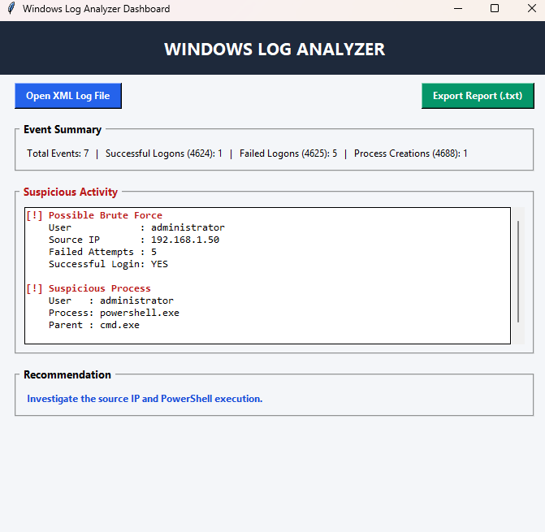

# Windows Log Analyzer

A Python-based Windows Log Analyzer mini project that parses XML-formatted Windows event logs, identifies potentially suspicious activity, and presents the analysis through a simple GUI dashboard.

This project was built as a practical cybersecurity project to understand basic log analysis and detection techniques commonly used in Security Operations Center (SOC) environments.

## Features

- Parses XML-formatted Windows event logs
- Provides an interactive GUI dashboard
- Displays event statistics
- Detects possible brute-force login activity
- Detects suspicious PowerShell execution
- Displays affected users and source IP addresses
- Provides investigation recommendations
- Allows users to open different XML log files
- Exports the analysis as a `.txt` report

## Detection Logic

The analyzer currently focuses on three Windows Event IDs:

| Event ID | Description |
|----------|-------------|
| `4624` | Successful logon |
| `4625` | Failed logon |
| `4688` | Process creation |

### 1. Possible Brute-Force Detection

The analyzer counts failed logon attempts from the same IP address.

If an IP generates **5 or more failed logon attempts**, it is flagged as a:

> Possible Brute Force

The analyzer also checks whether a successful login occurred from the same IP after the failed attempts.

### 2. Suspicious PowerShell Detection

The analyzer examines process creation events (`4688`).

If `powershell.exe` is detected, the activity is flagged for investigation and the associated user and parent process are displayed.

## Dashboard

The GUI provides:

- Event summary
- Suspicious activity section
- Source IP and user information
- Process and parent process information
- Investigation recommendation
- XML log file selection
- Report export functionality

![Windows Log Analyzer Dashboard]

## Example Detection

Using the included sample data, the analyzer identifies:

- 5 failed login attempts from `192.168.1.50`
- A successful login from the same IP
- PowerShell execution by the `administrator` account
- `cmd.exe` as the parent process

The dashboard consequently recommends investigating the source IP and PowerShell execution.

## Project Structure

```text
Windows-Log-Analyzer/
│
├── analyzer.py
├── generate_mock_logs.py
├── sample_logs.xml
├── screenshot.png
└── README.md
```

- **`analyzer.py`** — Main application containing:
  - XML log parsing
  - Event analysis
  - Brute-force detection
  - Suspicious PowerShell detection
  - GUI dashboard
  - Report generation
- **`generate_mock_logs.py`** — Generates sample XML event data for testing the analyzer.
- **`sample_logs.xml`** — Mock Windows event log data containing successful logons, failed logons, and process creation events.

## Requirements

- Python 3.x
- Tkinter

The project uses Python's built-in libraries, so no external packages are required.

## How to Run

1. Clone the repository

   ```bash
   git clone https://github.com/nanditha-a11y/security-lab-portfolio.git
   cd security-lab-portfolio
   ```

2. Navigate to the project

   ```bash
   cd windows-log-analyzer
   ```

3. Run the analyzer

   ```bash
   python analyzer.py
   ```

   The Windows Log Analyzer dashboard will open automatically using the included `sample_logs.xml`.

4. Generate new mock data

   If you want to regenerate the sample log file:

   ```bash
   python generate_mock_logs.py
   ```

   Then run:

   ```bash
   python analyzer.py
   ```

## Exporting a Report

The dashboard includes an **Export Report (.txt)** option that allows the detected events and recommendations to be saved as a text report.

## Limitations

This is a learning-focused prototype.

- The project currently analyzes XML-formatted mock event logs rather than native Windows `.evtx` files.
- Detection rules are intentionally simple and threshold-based.
- PowerShell execution is flagged for investigation but is not automatically classified as malicious.
- The project is not intended to replace a SIEM or production security monitoring solution.

## Cybersecurity Concepts Practiced

- Windows Event Logs
- Security Event IDs
- Authentication monitoring
- Brute-force detection
- Process monitoring
- PowerShell activity
- Log parsing
- Basic threat detection
- Alert generation
- Security investigation recommendations
- SOC-style analysis

## Future Improvements

Possible future improvements include:

- Native `.evtx` log support
- Additional Windows Event ID detection
- Detection of suspicious command-line arguments
- More authentication-based detection rules
- IP reputation checking
- Severity levels for alerts
- Graphs and visual statistics
- CSV/JSON report export
- Real-time Windows log monitoring
- Integration with a SIEM platform

## Disclaimer

This project uses simulated log data for educational and testing purposes. The detections are intended to demonstrate basic security monitoring concepts and should not be considered definitive indicators of compromise.